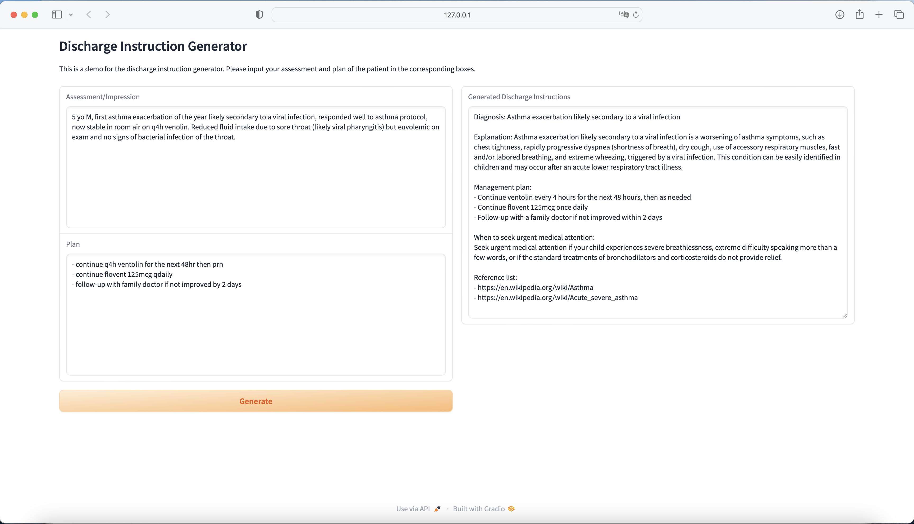

# ED Discharge Instruction Generator

## Aim
- The aim of this project is to practice creating a retrieval augmented generation (RAG) application.

## Motivation
- After a patient is seen in the emergency department and is deemed medically safe to be discharged, the standard practice is to counsel the patient and family regarding instructions to follow at home, and to provide a written summary of the discharge instructions. Although there are pre-generated templates (i.e., auto-text) available on the EMR, the list of templates is not exhaustive, and oftentimes they are not tailored to the clinical situation being discharged.
- As a result, for somewhat common diseases where template discharge instructions are not available, physicians need to manually type out the discharge instructions. For diseases with available templates, physicians still require manually modifying the template according to the patient's status. This leads to time wasted on writing/modifying discharge instructions and increases the risk of errors being made.
- The current state-of-the-art large language models (LLMs) may be able to generate reasonable and safe discharge instructions given a brief history of presenting illness. However, LLMs are susceptible to hallucinations, and without knowing where the LLMs derive content from, there may be a lack of trust from adoption by physicians and patients/families.

## Solution
- An application that generates discharge instructions for patients and families based on the patient's diagnosis and history of presenting illness. The instructions will be backed by evidence derived from trusted healthcare information sources in Canada.
- This app aims to generate discharge instructions that are not dependent on pre-generated templates, tailored to the patient's situation, and backed up by evidence.
- The aim is to reduce the amount of writing/editing of discharge instructions that physicians need to do; instead, they would only have to proofread the discharge instruction before printing it.

## Datasources
- Wikipedia
- datasource can be extended to any available healthcare information sources requested by the healthcare institution 

## Blueprint
- Input: De-identified information on the assessment and plan for the patient
- Custom parsers tailored to each datasource into txt format
- Vector database: custom built vector database (chroma) using information from trusted healthcare information sources
- Templates: 
    - for diagnsis extraction from the assessment statment provided
    - for discharge instruction generation
- Embedding: Hugginface-gbe
- LLM: 
    - OpenAI-GPT3.5: for letter generation
    - LLama2-13B: for retrieval content compression
- UI: gradio

